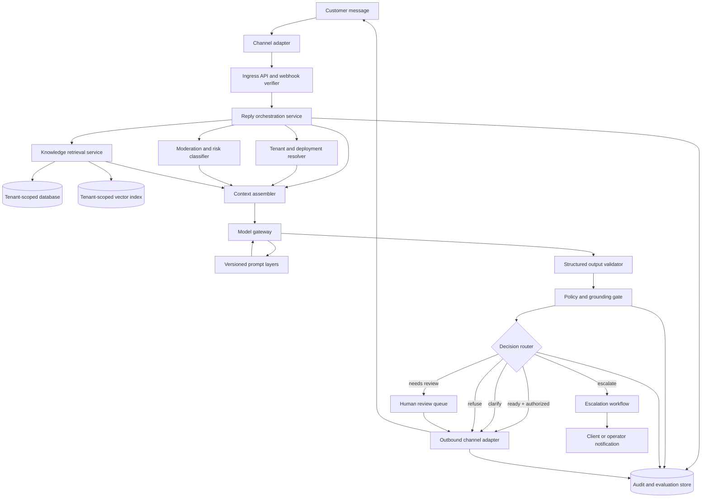

# ReplyForge AI Architecture

## 1. Architecture goals

ReplyForge should allow one creator-owned agent template to serve many independent client workspaces without mixing their data or permissions. The design should make the safest path the easiest path: every reply is grounded in approved context, every consequential action is permissioned, and every automated decision can be reviewed after the fact.

The initial system can be deployed as a modular service, but its interfaces should separate the core domain from model providers, retrieval infrastructure, messaging channels, and billing. This keeps the product extensible without requiring distributed services on day one.

## 2. High-level architecture



## 3. Component responsibilities

| Component | Responsibility | Must not do |
| --- | --- | --- |
| Channel adapter | Normalize inbound messages and deliver approved outbound replies | Decide business policy or bypass authorization |
| Ingress API | Verify webhook signatures, deduplicate events, and authenticate internal callers | Trust client-provided tenant IDs without server resolution |
| Tenant resolver | Resolve the deployment from a verified channel, account, or conversation | Search across tenants |
| Moderation and risk classifier | Identify sensitive, abusive, high-impact, or suspicious requests | Make final business claims |
| Knowledge service | Ingest, normalize, version, and retrieve approved client sources | Treat document instructions as runtime policy |
| Context assembler | Build bounded, traceable model context from authorized sources | Include unrelated tenants or unapproved drafts |
| Model gateway | Call the selected model with timeouts, retries, cost controls, and schema support | Grant tools or permissions to the model |
| Output validator | Enforce the response schema and basic constraints | Assume valid JSON means safe content |
| Policy and grounding gate | Check authorization, evidence support, privacy, and risk conditions | Silently rewrite high-risk actions without an audit record |
| Decision router | Convert the validated result into draft, send, clarify, review, or escalation | Upgrade automation beyond deployment policy |
| Review queue | Present drafts and evidence to a human approver | Expose another client’s data |
| Audit store | Record versions, evidence, decisions, tool results, and outcomes | Store secrets or unnecessary raw personal data |

## 4. Tenant and data model

The system should enforce tenant scope in the service layer and database layer. Every client-owned record should carry a `workspace_id`, and every request should obtain that identifier from a verified server-side relationship rather than trusting a request body.

| Boundary | Example data | Isolation rule |
| --- | --- | --- |
| Creator account | Creator identity, template ownership, rental settings | A creator can manage only templates and deployments they own |
| Agent template | Role, tone, supported intents, default guardrails | Shared behavior is versioned and contains no client secrets or private conversations |
| Client workspace | Business profile, policies, sources, channel connections | A workspace can access only its own business data |
| Deployment | Template version, workspace, automation mode, tool permissions | Every conversation resolves through one active deployment |
| Conversation | Customer messages, agent decisions, approvals, outcomes | Conversation queries require the owning workspace scope |
| Knowledge source | Documents, URLs, FAQs, embeddings, approval status | Retrieval filters by workspace and approved version before ranking |
| Credentials | Channel tokens, provider keys, webhook secrets | Store in a dedicated secret manager; never include them in model context or logs |

A practical relational foundation is a shared database with strict tenant predicates and repository-level scope checks. For higher-risk deployments, add database row-level security or separate schemas. The choice should be driven by threat modeling, operational maturity, and the sensitivity of client data rather than by the number of tables alone.

## 5. Request lifecycle

### Inbound processing

A channel adapter receives a message and converts it into a canonical event containing the provider event ID, channel, sender reference, conversation reference, message text, timestamp, and verified deployment reference. The ingress layer verifies the provider signature and records an idempotency key before enqueueing the event.

### Workspace resolution

The deployment resolver uses the verified channel connection and conversation mapping to identify exactly one client workspace. If the mapping is missing or ambiguous, the system must stop and send the event to an operational queue rather than guessing.

### Risk and intent pre-check

A lightweight classifier identifies likely intent and risk. This pre-check can route obvious spam, safety concerns, account-security issues, or high-impact requests to escalation before spending on a full generation call. It should be treated as a routing signal, not as the final answer.

### Retrieval and context assembly

The knowledge service retrieves only approved, current sources from the resolved workspace. Retrieval should apply tenant, source-status, effective-date, and permission filters before similarity ranking. The context assembler records evidence IDs and source versions, limits the total context size, and places data inside explicit delimiters.

### Generation

The model gateway receives the versioned platform prompt, creator template, client profile, bounded conversation history, retrieved evidence, current message, runtime mode, and authorized tool list. The model must return the response contract rather than free-form text.

### Policy gate and decision routing

The server validates the output, checks evidence IDs, applies risk and grounding checks, verifies action permissions, and selects the final state. A model cannot turn draft-only mode into automatic sending. Consequential actions require an authorized tool, a successful tool result, and any configured human approval.

### Delivery and audit

Approved customer-facing content is sent through the channel adapter. The platform stores a decision record with prompt versions, model metadata, evidence IDs, policy results, tool calls, approval identity, send status, and a redacted outcome. The audit record should be sufficient to reconstruct what happened without retaining unnecessary sensitive content.

## 6. Recommended service interfaces

```text
POST /v1/webhooks/{provider}
  Verify provider event and enqueue an inbound message.

POST /v1/workspaces/{workspaceId}/deployments
  Attach a versioned agent template to a client workspace.

POST /v1/workspaces/{workspaceId}/knowledge-sources
  Create or update an approved knowledge source.

POST /v1/reply-decisions
  Generate a structured reply decision for an authenticated deployment.

POST /v1/reply-decisions/{decisionId}/approve
  Approve a draft after a human reviews the reply and evidence.

POST /v1/reply-decisions/{decisionId}/send
  Send only when the server confirms current authorization and state.

POST /v1/reply-decisions/{decisionId}/feedback
  Record client or operator feedback for evaluation.
```

These endpoints are illustrative. The implementation should use a single canonical application service for reply decisions so channel-specific controllers cannot bypass the same validation and policy gates.

## 7. Asynchronous processing

Inbound events, knowledge ingestion, embedding generation, outbound delivery, and evaluation should run through durable jobs. Each job needs an idempotency key, retry policy, dead-letter path, timeout, and correlation ID. A failed outbound send must not cause the model to generate a second reply automatically unless the channel adapter confirms that the first attempt was not accepted.

The first release can use one worker process and one queue. The interface should still model jobs explicitly so ingestion and channel delivery can scale independently later.

## 8. Security and privacy controls

The minimum control set includes verified webhooks, authenticated operator actions, workspace-scoped authorization, encrypted credentials, redacted logs, expiring review links, rate limits, replay protection, idempotent event handling, and explicit retention settings.

Prompt injection is handled as a layered data-trust problem. The system must not rely on the model to distinguish all malicious text by itself. It should keep instructions out of retrieved data fields, label evidence as data, constrain tools at the server, validate every tool argument, and block secrets and cross-tenant identifiers before they reach the model or downstream providers.

## 9. Observability and evaluation

Every reply decision should have a correlation ID. Metrics should cover inbound processing latency, retrieval latency, model latency, policy-gate outcomes, escalation rate, approval rate, send failures, unsupported-claim findings, and feedback outcomes.

Maintain a versioned evaluation set containing routine questions, ambiguous questions, unsupported requests, policy exceptions, prompt-injection attempts, sensitive conversations, and cross-tenant access probes. Run the set whenever the platform prompt, creator template, retrieval strategy, model, or policy gate changes.

## 10. Deployment sequence

| Phase | Implementation focus | Exit condition |
| --- | --- | --- |
| Foundation | Domain types, workspace scoping, prompt assembly, response schema | A draft decision can be generated from a fixture without sending |
| Grounding | Knowledge ingestion, approval state, retrieval, evidence IDs | Replies cite only current workspace sources in evaluation |
| Safety | Policy gate, escalation states, tool permissions, redaction | High-risk fixtures are blocked or routed correctly |
| Human loop | Review queue, approval, feedback, audit views | A human can inspect and approve a draft with evidence |
| Channel | One inbound and outbound adapter | Messages are deduplicated, delivered, and auditable |
| Rental operations | Creator templates, deployments, usage, billing hooks | Multiple clients can use one template without data leakage |

## 11. Key architectural decision

Start as a **modular monolith with durable jobs**, not as a fleet of microservices. The most important early boundary is not network separation; it is the separation between tenant-scoped domain logic, model generation, channel delivery, and server-enforced policy. Once traffic, provider diversity, or team ownership requires it, the queue and these interfaces provide a path to split services without changing the agent contract.
